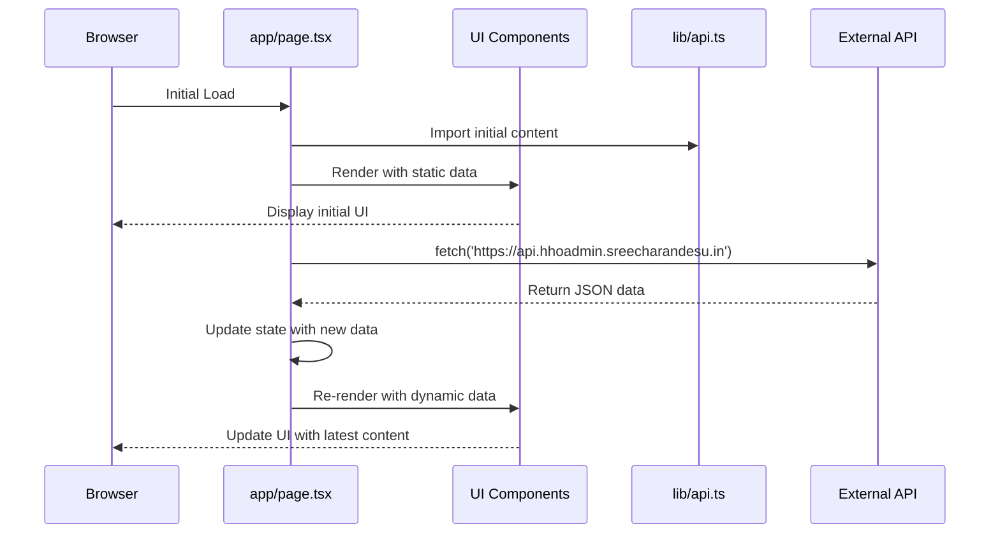
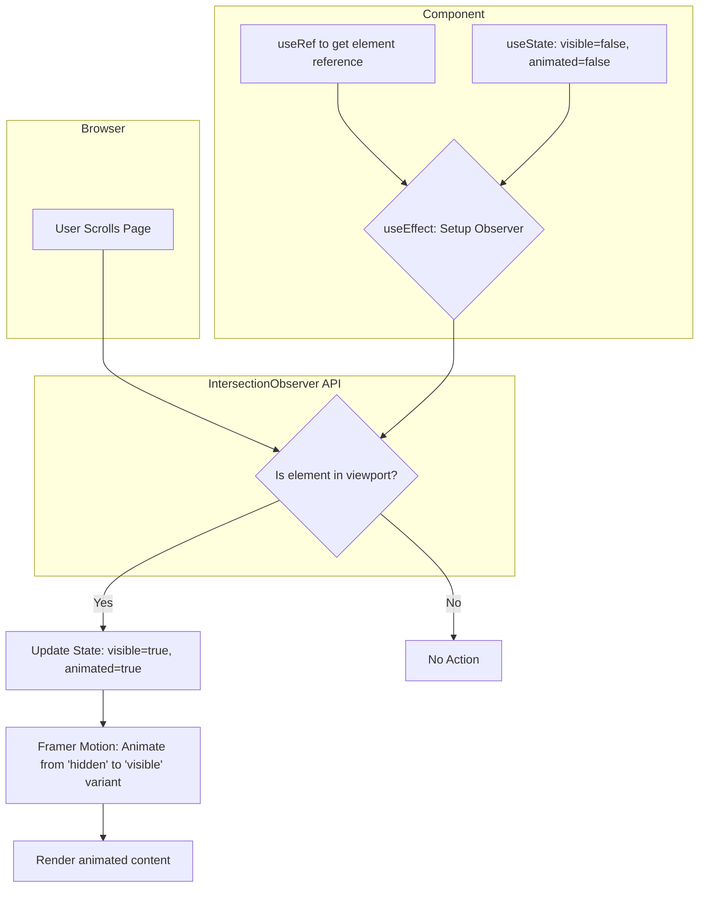
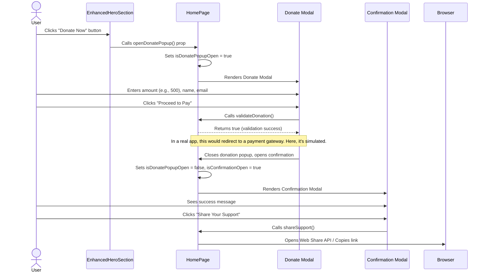
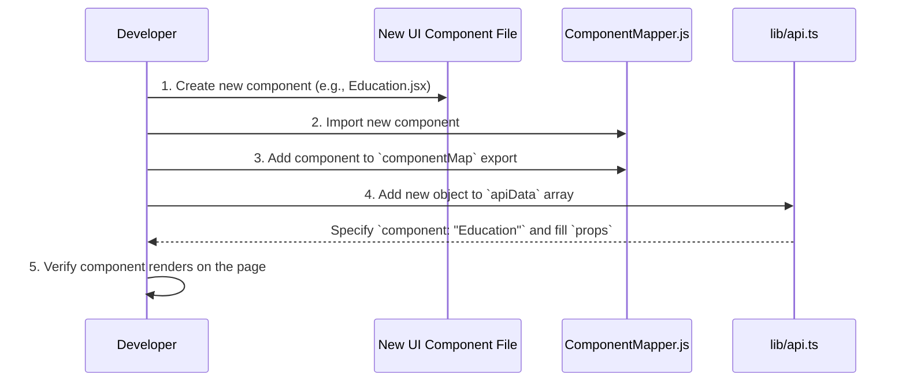

### System Overview: HHO Donation & Awareness Platform


This documentation outlines the architecture and functionality of the Helping Hands Organization (HHO) web platform. Built with Next.js, React, and TypeScript, the application serves as a dynamic, single-page interface for showcasing the organization's impact, driving fundraising campaigns, and engaging with the community.

The platform is heavily animated using **Framer Motion**, with a strong emphasis on user experience through scroll-triggered animations and interactive elements. Content is designed to be managed dynamically via an external API, with a fallback to statically defined data, ensuring resilience and maintainability.

**Core Technologies:**
*   **Framework:** Next.js 13+ (App Router)
*   **Language:** TypeScript
*   **UI Library:** React 18
*   **Styling:** Tailwind CSS
*   **Animation:** Framer Motion
*   **Icons:** Lucide React

---

### Architectural Design & Data Flow

The application follows a modular, component-based architecture. The `app/page.tsx` component acts as the central orchestrator, assembling the user interface from a collection of specialized components located in the `components/` directory.

#### Data Flow Model

The system employs a two-stage data loading strategy:

1.  **Initial Static Data:** Components are initially populated with fallback data imported from `lib/api.ts`. This ensures that the application can render immediately with meaningful content, even before dynamic data is fetched.
2.  **Dynamic API Fetch:** On page load, the `HomePage` component (`app/page.tsx`) sends a request to `https://api.hhoadmin.sreecharandesu.in`. Upon receiving a successful response, the application's state is updated, and the new data is propagated down to all child components as props, dynamically refreshing the site's content.

This flow can be visualized as follows:



#### State Management

*   **Global State:** The primary global state (site content, popup visibility) is managed within `app/page.tsx` using React's `useState` hook. This centralized approach simplifies state management for application-wide concerns like donation modals.
*   **Component-Local State:** Individual components manage their own UI-specific state. A common pattern is using `useState` to track animation triggers (e.g., `visibleSection`) or user interactions (e.g., `likedImages` in `ImagesGallery`).

---

### Core System: The Animate-on-Scroll Pattern

A foundational pattern across the application is triggering animations as components enter the viewport. This enhances performance by avoiding off-screen animations and creates an engaging user experience. This is achieved consistently across components like `About`, `Help`, `CurrentFundRaising`, and `UrgentHelp`.

**Implementation Workflow:**

1.  **Reference Element:** A `useRef` hook is attached to the component's root element.
2.  **State Tracking:** Two state variables, `visibleSection` and `hasAnimated`, are created. `visibleSection` triggers the animation, and `hasAnimated` prevents it from re-triggering on subsequent scrolls.
3.  **IntersectionObserver:** A `useEffect` hook initializes an `IntersectionObserver` to watch the referenced element.
4.  **Trigger Animation:** When the element intersects the viewport (`entry.isIntersecting`), the observer updates the state: `setVisibleSection(true)` and `setHasAnimated(true)`.
5.  **Framer Motion:** The `visibleSection` state is used to conditionally switch Framer Motion's `animate` prop from a "hidden" variant to a "visible" one, executing the animation.



**Code Example (`UrgentHelp.tsx`):**
```typescript
export default function UrgentHelpAlert() {
  const [visibleSection, setVisibleSection] = useState(false);
  const [hasAnimated, setHasAnimated] = useState(false);
  const sectionRef = useRef(null);

  useEffect(() => {
    const observer = new IntersectionObserver(
      ([entry]) => {
        // Trigger only if intersecting and not already animated
        if (entry.isIntersecting && !hasAnimated) {
          setVisibleSection(true);
          setHasAnimated(true);
        }
      },
      { threshold: 0.3 } // Trigger when 30% of the component is visible
    );

    if (sectionRef.current) {
      observer.observe(sectionRef.current);
    }

    return () => observer.disconnect();
  }, [hasAnimated]); // Dependency array ensures this runs only once

  const containerVariants = {
    hidden: { opacity: 0, scale: 0.95 },
    visible: {
      opacity: 1,
      scale: 1,
      transition: { staggerChildren: 0.1 },
    },
  };

  return (
    <motion.section
      ref={sectionRef}
      variants={containerVariants}
      initial="hidden"
      animate={visibleSection ? "visible" : "hidden"}
      // ...
    >
      {/* Animated child elements */}
    </motion.section>
  );
}
```

---

### Key Components & Functionality

#### 1. `app/page.tsx` - The Application Core

This component is the central hub of the application.

**Responsibilities:**
*   **Page Assembly:** Renders all major sections of the page in order (`Hero`, `About`, `CurrentFundRaising`, `ImagesGallery`, `Footer`, etc.).
*   **Data Orchestration:** Manages the `useEffect` hook to fetch site-wide data from the external API.
*   **Modal Management:** Controls the state for the "Help" and "Donate" popups (`isHelpPopupOpen`, `isDonatePopupOpen`). It passes down functions like `openDonatePopup` as props to child components.
*   **Event Handling:** Implements global logic such as form validation (`validateDonation`), clipboard actions (`copyToClipboard`), and social sharing (`shareSupport`).
*   **Navigation:** Provides `scrollToSection` functionality for smooth scrolling to different page sections via refs.

#### 2. `components/Hero.tsx` - EnhancedHeroSection

The hero section is the first thing a user sees. It's designed to be visually captivating and immediately communicate the organization's mission.

**Features:**
*   **Automated Slideshow:** Cycles through `heroMessages` fetched from the API every 7 seconds.
*   **Interactive Controls:** Users can pause/play the slideshow and navigate between slides manually. The slideshow automatically pauses on mouse hover.
*   **Parallax Effect:** Uses Framer Motion's `useScroll` and `useTransform` hooks to create a subtle vertical parallax effect on the background as the user scrolls.
*   **Accessibility:** Respects user preferences by disabling complex animations if `useReducedMotion` returns true.
*   **Donation Funnel:** The primary "Donate Now" button calls the `openDonatePopup` function passed from `HomePage`.

#### 3. `components/ImagesGallery.tsx` - DriveGallery

A highly dynamic and interactive gallery to showcase the organization's work visually.

**Features:**
*   **Data Source:** Loads a static list of image filenames from a local array (`imageFiles`) and transforms them into `DriveImage` objects.
*   **Infinite Marquee:** Creates four rows of images that scroll horizontally in an infinite loop. This is achieved by duplicating the images in each row (`[...row, ...row, ...row]`) and using a CSS animation.
*   **Lightbox Modal:** Clicking an image opens a full-screen modal view.
    *   **Navigation:** Supports keyboard (ArrowLeft, ArrowRight, Escape) and mouse-click navigation.
    *   **Actions:** Users can download, share (using Web Share API or copying URL), and "like" images. Likes are tracked in local component state.
*   **State Handling:** Manages loading and error states gracefully, providing feedback to the user.

**Marquee Logic (`createRows` function):**
The `createRows` function is key to the gallery's layout. It divides the images into four rows, ensuring a continuous, staggered look. It calculates an optimal number of items per row and uses the modulo operator (`%`) to loop through the image array, creating overlapping sets of images for each row.

```typescript
const createRows = (images: DriveImage[]) => {
  // Determine items per row, ensuring it's within a reasonable range
  const itemsPerRow = Math.max(8, Math.min(15, Math.ceil(images.length / 4)));
  const rows: DriveImage[][] = [];
  for (let i = 0; i < 4; i++) {
    // Stagger the start index for each row for visual variety
    const startIndex = (i * itemsPerRow) % images.length;
    const row: DriveImage[] = [];
    for (let j = 0; j < itemsPerRow; j++) {
      const imageIndex = (startIndex + j) % images.length;
      row.push(images[imageIndex]);
    }
    rows.push(row);
  }
  return rows;
};
```

#### 4. `components/Footer.tsx` - HHOFooter

The footer contains standard information but includes a unique security feature.

**Features:**
*   **Scroll-to-Top:** A button appears when the user scrolls down more than 400 pixels.
*   **Tamper Protection:** A client-side mechanism attempts to protect the founder's name from being modified in the source code.
    *   `sr3x0r`: An Immediately Invoked Function Expression (IIFE) that obfuscates the name "SreeCharan Desu" by constructing it from an array of characters.
    *   `computeHash`: A simple hashing function that generates an integer hash of a given string.
    *   `useEffect`: On component mount, it re-computes the name, hashes it, and compares it to a hardcoded expected hash (`1214823905`). If they don't match, it throws a critical error.

**Security Analysis:**
This is a form of client-side integrity check. While it can be bypassed by a determined user with developer tools, it serves as a deterrent against casual or automated modification of the deployed JavaScript files. It's a creative, albeit non-standard, security measure.

```typescript
// Obfuscated name computation
const sr3x0r = (function () {
  const chars = ['S','r','e','e','C','h','a','r','a','n',' ','D','e','s','u'];
  return () => chars.join('');
})();

// Hash function for tamper protection
const computeHash = (str: string) => {
  let hash = 0;
  for (let i = 0; i < str.length; i++) {
    hash = ((hash << 5) - hash) + str.charCodeAt(i);
    hash = hash & hash; // Convert to 32bit integer
  }
  return hash;
};

// ... inside HHOFooter component
useEffect(() => {
  const expectedName = sr3x0r();
  const expectedHash = 1214823905; // Pre-calculated hash of "SreeCharan Desu"
  if (computeHash(expectedName) !== expectedHash) {
    throw new Error('Critical: Unauthorized modification detected.');
  }
}, []);
```

#### 5. `components/KeyboardWatcher.tsx`

A global, silent component that listens for user keystrokes. It is included once in the root layout (`app/layout.tsx`), making it active on the entire site.

**Functionality:**
*   It attaches a `keydown` event listener to the window.
*   It captures alphanumeric keys, converts them to lowercase, and appends them to a string.
*   It only keeps track of the last 10 characters typed (`.slice(-10)`).

**Potential Use Cases:**
This component is an "easter egg" trigger. It could be used to:
*   Unlock a hidden debug menu.
*   Activate a secret feature or animation.
*   Enter a promotional code.

Currently, it only tracks the typed sequence but does not trigger any action. Developers can extend it by checking if the `typed` state matches a specific secret code.

---

### Workflows in Detail

#### User Donation Workflow

This is the most critical user conversion path on the site.



---

### Configuration & Environment

#### `next.config.ts`

The Next.js configuration file is currently minimal. The `images.remotePatterns` key is present but empty, indicating that the application is set up to use external images with `next/image` but is not currently configured for any specific domains. All gallery images are served statically from the `/public` directory.

#### `app/layout.tsx`

The root layout sets up the global structure of the HTML document.

**Key Responsibilities:**
*   **Global Styles:** Imports `globals.css`.
*   **Font:** Configures and applies the `Inter` font from `next/font`.
*   **Metadata:** Defines the default `title` and `description` for SEO.
*   **Global Components:** Renders the `<KeyboardWatcher />` component, ensuring it's active across all pages.

### System Documentation: Data-Driven UI Rendering

This document outlines the architecture and implementation of the data-driven UI rendering system. The core of this system is a centralized data structure, `apiData`, which defines the composition and content of UI layouts. This approach decouples the page structure from the application logic, enabling dynamic and easily configurable user interfaces.

***

### 1. System Overview

The primary function of this system is to dynamically render UI components based on a configuration array defined in `lib/api.ts`. Instead of hard-coding a layout with specific components, a renderer iterates through the `apiData` array. Each object in this array acts as a blueprint, specifying which component to render and what properties (props) to pass to it.

**Key Benefits:**

*   **Dynamic Layouts:** UI structure can be changed without deploying new application code. Layouts can be modified by simply updating the `apiData` configuration.
*   **Decoupling:** The presentation layer (what is shown) is separated from the rendering logic (how it's shown).
*   **Reusability:** Simplifies the process of reusing components in different orders or configurations across the application.
*   **Rapid Development:** Developers can add, remove, or reorder entire sections of a page by editing a single array.

### 2. Architectural Flow

The system operates on a simple, unidirectional data flow. The `apiData` array serves as the single source of truth for the layout. A generic rendering component consumes this data and translates it into a live UI.

#### Data Flow Diagram

This diagram illustrates how the `apiData` configuration is transformed into rendered UI components.

```mermaid
flowchart TD
    A[lib/api.ts<br><b>export const apiData</b>] --> B{Dynamic Page/Renderer Component};
    B --> C{Iterate over apiData array};
    C --> D{For each object...};
    D --> E[Component Mapper<br><em>(Resolves string to Component)</em>];
    E --> F[Render Component<br><em>(e.g., <ProfessionalSections />)</em>];
    F --> G([Final Rendered UI]);

    subgraph "Data Configuration"
        A
    end

    subgraph "Rendering Logic"
        B
        C
        D
        E
        F
    end

    subgraph "Output"
        G
    end
```

**Flow Breakdown:**

1.  **Configuration (`lib/api.ts`):** The `apiData` array is defined and exported. It contains a list of objects, each representing a UI section.
2.  **Renderer Component:** A primary component (e.g., a page container) imports `apiData`.
3.  **Iteration:** The renderer maps over the `apiData` array.
4.  **Component Mapping:** For each object in the array, a utility or mapping mechanism resolves the `component` string (e.g., `"ProfessionalSections"`) to an actual, importable UI component.
5.  **Instantiation:** The resolved component is rendered, and the `props` from the data object are spread onto it.
6.  **Final UI:** The collection of rendered components forms the final user interface.

### 3. The `apiData` Schema

The `apiData` constant is an array of objects, where each object must conform to a specific schema to be rendered correctly.

**File:** `lib/api.ts`

```typescript
// lib/api.ts

// This is a conceptual, expanded example based on the provided code.
// The actual file may contain more varied components and properties.

export const apiData = [
  {
    id: 'prof-sections',
    component: 'ProfessionalSections',
    props: {
      title: 'Professional Experience',
      defaultOpen: true,
      experiences: [
        {
          role: 'Senior Software Engineer',
          company: 'Tech Solutions Inc.',
          duration: '2020 - Present',
          details: [
            'Led the development of a new microservices architecture.',
            'Improved system performance by 30% through query optimization.'
          ]
        }
      ]
    }
  },
  {
    id: 'skills-summary',
    component: 'SkillsGrid',
    props: {
      title: 'Core Competencies',
      skills: ['TypeScript', 'React', 'Node.js', 'AWS', 'Terraform']
    }
  },
  {
    id: 'contact-form',
    component: 'ContactForm',
    props: {
      endpoint: '/api/contact/submit',
      submitButtonText: 'Send Message'
    }
  }
];
```

#### Schema Fields:

*   `id` (string, required): A unique identifier for the component instance. Used for React keys and DOM element IDs.
*   `component` (string, required): The name of the component to render. This string must have a corresponding entry in the component mapper.
*   `props` (object, optional): An object containing all the properties to be passed to the rendered component. The structure of this object is entirely dependent on the requirements of the target component.

### 4. Implementation and Usage

A developer interacts with this system primarily by modifying `lib/api.ts` or by creating new components that can be referenced by it.

#### Example Rendering Logic

While the exact implementation can vary (React, Vue, etc.), the core logic remains the same. Below is a conceptual example of a React component that would render a UI from `apiData`.

```jsx
// components/ComponentMapper.js
// This file maps string names to actual component imports.
// It's crucial for decoupling the data from the implementation.

import ProfessionalSections from './sections/ProfessionalSections';
import SkillsGrid from './widgets/SkillsGrid';
import ContactForm from './forms/ContactForm';

export const componentMap = {
  ProfessionalSections,
  SkillsGrid,
  ContactForm,
};

// components/DynamicRenderer.jsx
// This component consumes the data and renders the UI.

import React from 'react';
import { apiData } from '../lib/api';
import { componentMap } from './ComponentMapper';

export function DynamicRenderer() {
  return (
    <main>
      {apiData.map((block) => {
        // Look up the component in the map
        const ComponentToRender = componentMap[block.component];

        // Handle cases where the component string is invalid
        if (!ComponentToRender) {
          console.error(`Component not found for name: ${block.component}`);
          return null; // Or render a placeholder/error component
        }

        // Render the component, passing its ID as a key and its props
        return <ComponentToRender key={block.id} {...block.props} />;
      })}
    </main>
  );
}
```

### 5. Developer Workflow: Adding a New Section

Adding a new, dynamic section to a page is a straightforward process. This workflow ensures that new UI elements are correctly integrated into the system.

#### Workflow Diagram



**Step-by-Step Guide:**

1.  **Create the Component:** Build your new component (e.g., `Education.jsx`) with standard props-based logic. Ensure it is self-contained and reusable.

    ```jsx
    // components/sections/Education.jsx
    import React from 'react';

    export default function Education({ title, institutions }) {
      return (
        <section>
          <h2>{title}</h2>
          <ul>
            {institutions.map(inst => <li key={inst.degree}>{inst.degree} at {inst.name}</li>)}
          </ul>
        </section>
      );
    }
    ```

2.  **Register in Component Mapper:** Import the new component into the central `ComponentMapper.js` and add it to the exported map. This makes the renderer aware of it.

    ```javascript
    // components/ComponentMapper.js
    import ProfessionalSections from './sections/ProfessionalSections';
    import SkillsGrid from './widgets/SkillsGrid';
    import ContactForm from './forms/ContactForm';
    import Education from './sections/Education'; // <-- Import new component

    export const componentMap = {
      ProfessionalSections,
      SkillsGrid,
      ContactForm,
      Education, // <-- Add to map
    };
    ```

3.  **Update `apiData`:** Add a new configuration object to the `apiData` array in `lib/api.ts`.

    ```typescript
    // lib/api.ts
    export const apiData = [
      // ... other component objects
      {
        id: 'education-history',
        component: 'Education', // <-- Use the string key from the map
        props: {
          title: 'Academic History',
          institutions: [
            { name: 'State University', degree: 'B.S. in Computer Science' },
            { name: 'Online Academy', degree: 'Certificate in Cloud Engineering' }
          ]
        }
      }
    ];
    ```

Once these steps are complete, the `DynamicRenderer` will automatically pick up the new configuration and render the `Education` component in the correct position with the specified props.

### 6. Advanced Considerations & Best Practices

#### Performance: Lazy Loading

For applications with many potential components, importing all of them into `ComponentMapper.js` can negatively impact the initial bundle size. To optimize this, use dynamic imports (`React.lazy`) to code-split and load components only when they are needed.

**Example with `React.lazy`:**

```jsx
// A more advanced ComponentMapper using lazy loading
import React, { Suspense } from 'react';

const componentMap = {
  ProfessionalSections: React.lazy(() => import('./sections/ProfessionalSections')),
  SkillsGrid: React.lazy(() => import('./widgets/SkillsGrid')),
  // ... other lazy-loaded components
};

// The renderer would need to wrap the component in <Suspense>
export function DynamicRenderer() {
  return (
    <main>
      <Suspense fallback={<div>Loading...</div>}>
        {apiData.map((block) => {
          const ComponentToRender = componentMap[block.component];
          if (!ComponentToRender) return null;
          return <ComponentToRender key={block.id} {...block.props} />;
        })}
      </Suspense>
    </main>
  );
}
```

#### Error Handling and Troubleshooting

*   **Component Not Found:** If a `component` string in `apiData` does not match a key in `componentMap`, the component will fail to render. The example renderer includes a `console.error` for this case. In a production environment, this should log to an error tracking service, and a fallback UI should be shown.
*   **Incorrect Props:** Prop validation errors will originate from the child components themselves. Using TypeScript or `PropTypes` in each component is highly recommended to catch schema mismatches between the `props` object in `apiData` and what the component expects.
*   **Duplicate `id` Keys:** Ensure the `id` field in each `apiData` object is unique. Duplicate keys will cause React rendering warnings and can lead to unpredictable state behavior.
